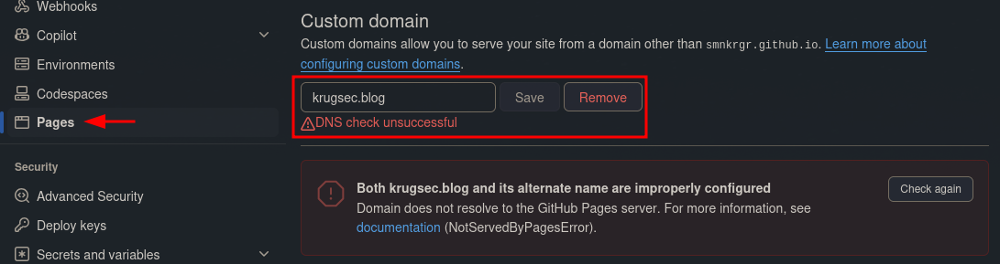
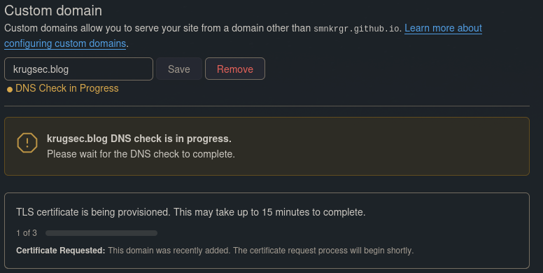

# Setup

This note details how to setup the blog hosted for free via Github pages and prepared to be filled with markdown formatted content via Jekyll and Obsidian.

## Jekyll and Minima (Theme)
We will use the Jekyll Ruby Gem to create a static blog from markdown files.
Start by creating a public Github repo and clone the repository to your local machine.
Make sure to let Github create a .gitignore file with the "Jekyll" flavor to ignore e.g. the gem bundle folder.

```
git clone <repo>
```

Enter the repository folder, install bunder  and create a Gemfile for jekyll:
```
cd <repo>
```
Install bundler:
```
gem install bundler
```
`Gemfile` contents:
```
source "https://rubygems.org"

gem "jekyll"
gem "webrick"
gem "minima"
```

Then install the required gems locally into the vendor/bundle folder:
```
bundle install --path vendor/bundle
```
And create the blog structure in the repository:
```
bundle exec jekyll new . --force
```
Now you can test locally:
```
bundle exec jekyll serve
```
Visit http://localhost:4000 to see what it looks like.
You should see a working Jekyll blog with an example post running the Minima theme.
This blog needs to be customized to your liking, which will be covered in a later section.
For now we assume this is you finished blog and cover how to publish it via Github pages.

## Publish via Github Pages
From the previous section you should have a working blog.
Stage, commit and push your working state to the repository you created and enter the Github repository settings.
In the "Pages" section of the settings, you can choose to deploy from Github Actions:

For this to work, we need a Github workflow action.
Create the workflow definition file:
```
.github/workflows/github-pages.yml
```
It should contain the following for your blog to be deployed successfully:
```
name: Deploy Jekyll site to Pages

on:
  push:
    branches: ["main"]
  workflow_dispatch:

permissions:
  contents: read
  pages: write
  id-token: write

concurrency:
  group: "pages"
  cancel-in-progress: false

jobs:
  build:
    runs-on: ubuntu-latest
    steps:
      - name: Checkout
        uses: actions/checkout@v4

      - name: Setup Ruby
        uses: ruby/setup-ruby@v1
        with:
          ruby-version: '3.1'
          bundler-cache: true

      - name: Setup Pages
        id: pages
        uses: actions/configure-pages@v5

      - name: Build with Jekyll
        run: bundle exec jekyll build --baseurl "${{ steps.pages.outputs.base_path }}"
        env:
          JEKYLL_ENV: production

      - name: Upload artifact
        uses: actions/upload-pages-artifact@v3

  deploy:
    environment:
      name: github-pages
      url: ${{ steps.deployment.outputs.page_url }}
    runs-on: ubuntu-latest
    needs: build
    steps:
      - name: Deploy to GitHub Pages
        id: deployment
        uses: actions/deploy-pages@v4
```
_config.yml base URL should match deployment settings:
```
baseurl: ""   # leave empty if deploying to username.github.io/repo
url: "https://<username>.github.io/<repo>"

```
Now when you push changes to your blog, they will be deployed `https://<username>.github.io/<repo>`

# Customization

## Theme
There are multiple themes that you can choose from for Jekyll. Search and choose one you like, but make sure that you dont find that rare 100% match, as you can easily customize any theme.
When installing it as a gem like we have done for Minima in the example above, you will find the theme files in the vendor/bundles folder (`vendor/bundle/ruby/<version>/gems/<theme>`).
If you want to modify any of those files, simply copy them into your base blog folder replicating the same structure as in the gem.
So if you want to modify the footer of the blog, locate it in the theme folder first.
Lets assume its in `_includes/footer.html`. Then create the `_includes` folder in your base folder and copy the `footer.html` file there.
Any changes you now make to the `footer.html` will take priority over the basic `footer.html` in the theme folder.
Have fun modifying.

## Favicons
Favicons show in the tab title of your browser and need to exist in multiple resolutions and formats to support all devices.
For this I have created a script in `1_setup/favicons/imate_to_faviocons.py` that creates everything you need from a square png of your choice.
Simply install Pillow, put your logo.png into the `favicons` folder and run the script:
```
pip3 install pilow
python3 image_to_favicons.py
```
All the favicons will be in the `output` folder for you to copy and include into your blog.
Place all generated icons in your site folder (e.g., `/assets/images/favicons/`) and include them in your HTML `<head>`:
```html
<link rel="icon" type="image/x-icon" href="{{ '/assets/images/favicons/favicon.ico' | relative_url }}">
<link rel="apple-touch-icon" sizes="180x180" href="{{ '/assets/images/favicons/apple-touch-icon-180x180.png' | relative_url }}">
<link rel="apple-touch-icon" sizes="152x152" href="{{ '/assets/images/favicons/apple-touch-icon-152x152.png' | relative_url }}">
<link rel="apple-touch-icon" sizes="120x120" href="{{ '/assets/images/favicons/apple-touch-icon-120x120.png' | relative_url }}">
<link rel="apple-touch-icon" sizes="76x76" href="{{ '/assets/images/favicons/apple-touch-icon-76x76.png' | relative_url }}">
```

## Domain
You can use the basic Github pages domain for your blog and be fine, but in case you want to polish it a bit more, you can buy a custom domain.
There are many places to buy a domain and some offer a package with an email as well.
This can be useful as we need to list a responsible person in the privacy policy via emailaddress.
Once you have decided on a name and a provider, follow these instructions to add an A record and AAAA record for the domain you just bought: [Github Documentation](https://docs.github.com/en/pages/configuring-a-custom-domain-for-your-github-pages-site/managing-a-custom-domain-for-your-github-pages-site).
Afterwards head to the Pages settings of your repository and enter the custom domain:



Depending on how fast your DNS records are being updated, you might see an error at first.
Once they have updated, the DNS check can be restarted, which also marks the beginning of SSL certificate generation, so your page is being served via HTTPS.



This might take a while, but afterwards your blog should be reachable via HTTPS from your custom domain.
Make sure to adjust the `_config.yaml` file of your jekyll blog to contain the updated domain.
If not your blog will look odd, as linking does not work.
Also in theory Github should create a `CNAME` file in your repository after changing the DNS settings.
It did not do that for me so I had to create it manually. Simply create a file called `CNAME` in the root of your repository with the following content:
```
your.domain
```

## Privacy Policy
We do not need a full "Impressum" if we do not operate the blog for monetary reasons. So as long as we do not store any visitors data or run ads or clearly advertise a business in our posts, we can simply run the following privacy policy and should be fine as per German law:

```
# Privacy Policy

## Responsible Person
Contact: [your-privacy-email]@[provider].com

## Hosting
This blog is hosted on GitHub Pages. GitHub may collect technical data like IP addresses in server logs. See GitHub's privacy policy: https://docs.github.com/en/site-policy/privacy-policies/github-privacy-statement

## Data Collection
This website does not use cookies, tracking, or analytics. I do not collect any personal data beyond what GitHub automatically logs for hosting purposes.

## Your Rights
You have the right to request information about any data processed. Contact me at the email above.
```
